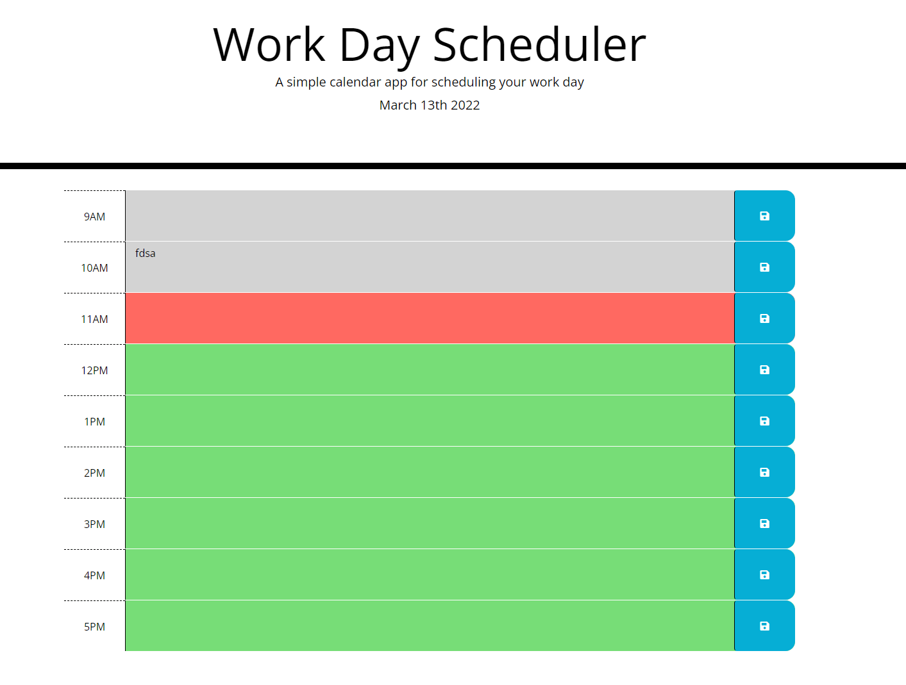

Work Day Scheduler is a webpage where a user can add events during standard work-day hours, including color-coding to display which events are past, in progress, and in the future. Added events are saved so th at the user can refresh the page without losing their schedule. 

Deployed URL: https://rachelgray7448.github.io/work-day-scheduler/

